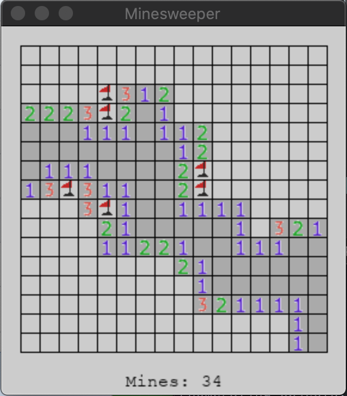
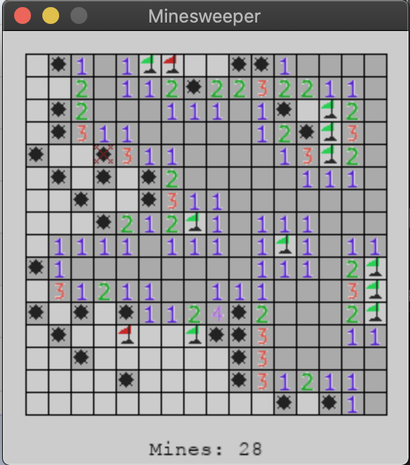

<h1 align="centre">
    Minesweeper
</h1>

<h4 align="centre">
    The classic minesweeper game in python
</h4>

## Usage

```bash
python minesweeper.py
```

## Gameplay

<div align="centre">
    
</div>

<div align="centre">
    
</div>
